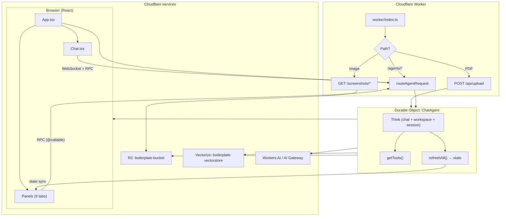
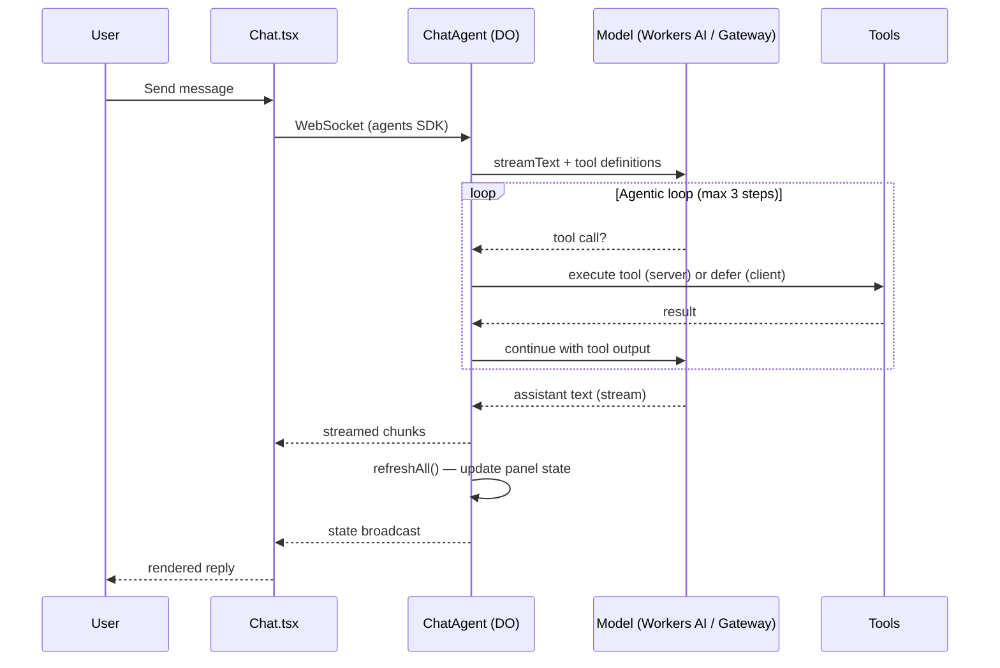

# jinu-agent-nexus — Architecture Overview

> **For whom:** Project owner and collaborators who want to understand *what
> exists* and *how data flows* without reading every source file.
>
> **For implementation details:** see `CLAUDE.md` (LLM dev guide) and
> `README.md` / `README.eng.md` (setup & deploy).

---

## What this system is

A **single-user AI chat agent** that runs on Cloudflare:

- **Frontend** — React app in the browser (chat + 9 side panels)
- **Backend** — one **Durable Object** (`ChatAgent`) per agent name (`"default"`)
- **AI** — Workers AI by default; optional AI Gateway for production
- **Storage** — DO SQLite (chat, workspace, RAG chunks), R2 (skills, PDFs,
  screenshots), Vectorize (embeddings)

The agent can chat, remember context, load skills, search uploaded PDFs,
control a remote browser, schedule reminders, write its own tools at runtime,
and connect to external MCP servers.

---

## UI layout

```
┌─────────────────────────────────────────────────────────────────┐
│  Agent — jinu-agent-nexus                                       │
├──────────────────────────────┬──────────────────────────────────┤
│                              │  [Memory][Skills][Files][Tools]… │
│  Chat                        │                                  │
│  • message list              │  One panel visible at a time     │
│  • tool calls / approvals    │  (9 tabs on the right)           │
│  • input                     │                                  │
│                              │  Reads live `agent.state`        │
└──────────────────────────────┴──────────────────────────────────┘
         src/chat/Chat.tsx              src/panels/*.tsx
                    ↑                           ↑
                    └──── useAgent (WebSocket + RPC) ────┘
                                    src/App.tsx
```

---

## End-to-end request flow



---

## One chat turn (simplified)



**Client-side tools** (e.g. timezone): model asks → browser runs in
`Chat.tsx` `onToolCall` → result sent back to agent.

**Approval tools** (e.g. notifications): model asks → user clicks Approve/Reject
in `Message.tsx` → then server `execute` runs.

---

## Feature map

| Feature | UI (panel) | Main code | Where data lives |
|---------|------------|-----------|------------------|
| Chat | Chat (left) | `worker/chat-agent.ts`, `src/chat/` | DO SQLite (messages) |
| Memory | Memory | session context block `"memory"` | DO SQLite (session) |
| Skills | Skills | R2 skill provider, `skills/*.md` | R2 `skills/` |
| Workspace files | Files | Think workspace tools (`read`, `write`, …) | DO SQLite |
| Tool list | Tools | `getTools()` + extension/MCP merge | In-memory snapshot in `state` |
| PDF / RAG | Sources | `uploadPdf`, `recall.ts`, `ingest.ts` | R2 `pdfs/`, Vectorize, DO `chunks` |
| Browser | Browser | `navigate.ts`, `screenshot.ts`, Puppeteer | Remote browser session + R2 screenshots |
| Schedules | Schedules | `setReminder.ts`, DO alarms | DO schedule store |
| Runtime tools | Extensions | `load_extension`, `worker_loaders` | Sandboxed worker per extension |
| MCP | MCP | `connectMcpServer`, etc. | External MCP servers |

---

## Custom tools (examples)

All live under `worker/tools/` and register in `getTools()` inside
`chat-agent.ts`.

| Tool file | Purpose | Runs on |
|-----------|---------|---------|
| `getCurrentTime.ts` | Current UTC time | Server |
| `getWeather.ts` | Weather via Open-Meteo | Server |
| `getUserTimezone.ts` | Browser timezone | **Client** (`Chat.tsx`) |
| `sendNotification.ts` | Browser notification | Server + **approval** |
| `setReminder.ts` | Schedule a reminder | Server (DO alarm) |
| `recall.ts` | RAG search over PDFs | Server (Vectorize + SQL) |
| `navigate.ts` | Open URL in browser | Server |
| `screenshot.ts` | Capture page → R2 | Server |

Built-in **Think** tools (not in `worker/tools/`): `read`, `write`, `edit`,
`list`, `find`, `grep`, `delete`, `set_context`, `load_context`,
`unload_context`, `load_extension`, …

---

## Backend layers

```
worker/index.ts          HTTP entry — routes only, thin
    │
    ├── POST /api/upload     → ChatAgent.uploadPdf()
    ├── GET  /screenshots/*  → stream from R2
    └── /agents/ChatAgent/default  → WebSocket + RPC
              │
worker/chat-agent.ts     Brain — configuration + domain logic (~780 lines)
    │
    ├── Think config       model, session prompt, skills, memory
    ├── getTools()         custom + extension tools
    ├── refreshAll()       panel state → this.state
    ├── RAG                PDF ingest, delete sources
    ├── Browser            Puppeteer session, Live View URL
    ├── MCP callables      connect / disconnect servers
    └── Panel callables    clear, reset, cancel schedule, …

worker/ai.ts             Model routing (@cf/ vs AI Gateway)
worker/ingest.ts         Markdown chunking for RAG
worker/tools/*.ts        One tool per file
```

> **Note:** `chat-agent.ts` is intentionally the central file today. A future
> refactor may split it by domain (RAG, browser, panel callables) without
> changing behavior.

---

## Panel state sync

Panels do **not** fetch their own data. Flow:

1. `ChatAgent.refreshAll()` reads workspace, session, SQL, schedules, tools, …
2. Writes one object to `this.state` (`State` type in `chat-agent.ts`)
3. Agents SDK broadcasts state to all connected tabs
4. `App.tsx` passes `agent.state` into each panel component

Called after: cold start, every chat turn, and most `@callable` mutations.

---

## Cloudflare bindings (current)

| Binding | Resource name | Used for |
|---------|---------------|----------|
| `ChatAgent` | DO class | Stateful agent instance |
| `BUCKET` | `boilerplate-bucket` | Skills, PDFs, screenshots |
| `VECTOR_DB` | `boilerplate-vectorstore` (768-dim) | RAG embeddings |
| `AI` | Workers AI | Default models + PDF→markdown |
| `BROWSER` | Browser Rendering (remote) | Navigate / screenshot / Live View |
| `LOADER` | worker_loaders | Runtime extensions |

**Vars** (`wrangler.jsonc`): `ACCOUNT_ID`, `AI_GATEWAY_NAME`, `CHAT_MODEL`,
`EMBEDDING_MODEL`.

**Secret** (`.dev.vars` / production): `API_TOKEN` — Browser Live View + AI
Gateway auth.

> R2/Vectorize still use `boilerplate-*` names from initial setup. The Worker
> and repo are renamed to `jinu-agent-nexus`; infra names can stay until you
> deliberately recreate resources.

---

## Frontend file map

| Path | Role |
|------|------|
| `src/main.tsx` | React entry |
| `src/App.tsx` | Layout, `useAgent`, panel tabs, theme |
| `src/chat/Chat.tsx` | Messages, input, client tools |
| `src/chat/Message.tsx` | Message rendering, tool UI, approvals |
| `src/chat/Markdown.tsx` | Markdown in replies |
| `src/panels/*.tsx` | One panel per feature tab |
| `src/components/ui/` | Shared UI primitives |

---

## Adding something new (where to look)

| You want… | Start here |
|-----------|------------|
| New capability the LLM can call | `worker/tools/` + README "Adding a tool" |
| New right-side tab | `src/panels/` + `App.tsx` `PANELS` |
| New persistent panel field | `State` + `refreshAll()` in `chat-agent.ts` |
| Different AI model | `wrangler.jsonc` vars → `worker/ai.ts` |
| Onboarding / deploy steps | `README.md` |
| LLM implementation rules | `CLAUDE.md` |

---

## Related docs

| Document | Audience |
|----------|----------|
| `ARCHITECTURE.md` (this file) | High-level structure & flows |
| `CLAUDE.md` | AI assistants implementing features |
| `README.md` | Setup, deploy, course-aligned how-tos |
| `README.eng.md` | English README |
