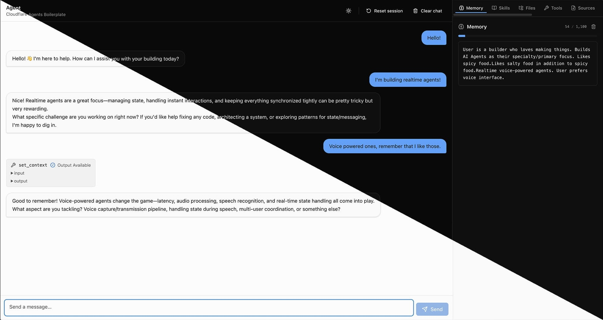

# Cloudflare Agent Boilerplate

> Korean version — [README.md](./README.md)

A production-shaped Cloudflare Agents starter — chat, durable memory,
on-demand skills, virtual filesystem, RAG over PDFs, a live browser,
durable schedules, runtime self-written tools, and an MCP client — all
wired up and ready to fork.

Built as the companion boilerplate to the [**Nomad Coders Cloudflare
Agents course**](https://nomadcoders.co/nomadclaw). Every feature in
here is taught in the course; the README sections below tell you
*which phase* covers each one and where to extend.



---

## Table of contents

1. [Quick start](#quick-start)
2. [Required setup](#required-setup)
   - [`wrangler.jsonc` vars](#1-wranglerjsonc-vars)
   - [`.dev.vars` secrets](#2-devvars-secrets)
   - [Vectorize + R2 + skills (one command)](#3-vectorize-index--r2-bucket--skills-seed)
3. [Before production — switch to AI Gateway](#before-production--switch-to-ai-gateway)
4. [Project structure](#project-structure)
5. [How it works](#how-it-works)
6. [Switching models](#switching-models)
7. [Adding a tool](#adding-a-tool)
8. [Adding a panel](#adding-a-panel)
9. [Adding a skill](#adding-a-skill)
10. [Connecting an MCP server](#connecting-an-mcp-server)
11. [Deploy](#deploy)
12. [Recipes — adding the features we left out](#recipes--adding-the-features-we-left-out)

---

## Quick start

```bash
# 1. Install
npm install

# 2. Minimal config
cp .dev.vars.example .dev.vars        # paste API_TOKEN (only needed for
                                       # the Live Browser panel — see below)
#   then edit wrangler.jsonc → vars.ACCOUNT_ID

# 3. Create the Cloudflare resources (R2 + Vectorize + seed skills)
npm run setup

# 4. Run
npm run dev                            # http://localhost:5173
```

**Default model is `@cf/zai-org/glm-4.7-flash` running on Workers AI**
— free tier (10k neurons/day), no extra setup. Chat works
out of the box. When you're ready to ship to production, switch to
AI Gateway with Unified Billing — see [Before production — switch to
AI Gateway](#before-production--switch-to-ai-gateway).

---

## Required setup

### 1. `wrangler.jsonc` vars

Open `wrangler.jsonc` and fill in:

```jsonc
"vars": {
  "ACCOUNT_ID": "your-cloudflare-account-id",     // from dash.cloudflare.com
  "AI_GATEWAY_NAME": "agent-boilerplate",         // (unused until you switch to AI Gateway)
  "CHAT_MODEL": "@cf/zai-org/glm-4.7-flash",      // Workers AI default
  "EMBEDDING_MODEL": "@cf/baai/bge-base-en-v1.5", // 768-dim, matches Vectorize
}
```

`ACCOUNT_ID` is in the right sidebar of the Cloudflare dashboard.
You need it for the Live Browser panel (Browser Rendering DevTools
API) and for AI Gateway once you switch over. Browser-less builds
can leave it as the placeholder.

`CHAT_MODEL` and `EMBEDDING_MODEL` are documented in detail under
[Switching models](#switching-models). The default is the Workers AI
stack — zero gateway setup, works free.

### 2. `.dev.vars` secrets

Copy the template and fill in:

```bash
cp .dev.vars.example .dev.vars
```

```ini
API_TOKEN=your-cloudflare-api-token
```

The token is **required** for the Live Browser panel (it signs the
DevTools Live View URL). If you don't use the Browser panel and
you're sticking with the Workers AI default, you can leave it
empty — chat still works.

Once you switch to AI Gateway (next major section), this same token
becomes the gateway auth + Unified Billing identity.

Create the token at: <https://dash.cloudflare.com/profile/api-tokens>

Required permissions:

- **Account → Browser Rendering → Edit**
- **Account → AI Gateway → Run** (add this when you switch to AI Gateway)

For production, push the secret with: `npx wrangler secret put API_TOKEN`

### 3. Vectorize index + R2 bucket + skills seed

The fastest path is the all-in-one script:

```bash
npm run setup
```

That runs three things in sequence, each idempotent (already-exists
errors are caught and turned into "skip" messages, not failures):

1. `wrangler r2 bucket create boilerplate-bucket`
2. `wrangler vectorize create boilerplate-vectorstore --dimensions=768 --metric=cosine`
3. `wrangler r2 object put boilerplate-bucket/skills/*.md --remote`

If you'd rather run them by hand:

```bash
npm run setup:r2          # creates R2 bucket "boilerplate-bucket"
npm run setup:vectorize   # creates Vectorize index, 768-dim cosine
npm run seed:skills:remote
```

If you renamed the bucket or index in `wrangler.jsonc`, update the
names at the top of `scripts/setup.mjs` and the matching scripts in
`package.json`.

**Vectorize dimensions are immutable.** The default 768 matches
`@cf/baai/bge-base-en-v1.5` (the default `EMBEDDING_MODEL`). If you
switch to a different embedding model, drop the index and recreate
it with the right dimensions — see [Switching models](#switching-models).

---

## Before production — switch to AI Gateway

The Workers AI default is great for getting started, but for a
production deploy you almost certainly want to route through
**Cloudflare AI Gateway**. The gateway gives you:

- **A dashboard view** of every prompt, response, latency, and cost
- **Prompt-response caching** (cuts cost on repeat queries)
- **Per-route rate limiting**
- **Provider fallbacks** (try Anthropic, fall back to OpenAI on error)
- **Unified Billing** — pay OpenAI / Anthropic / Google with
  Cloudflare credits, no upstream provider key required

### Setup (one-time, in the Cloudflare dashboard)

1. Create a gateway:
   <https://dash.cloudflare.com/?to=/:account/ai-gateway>
2. Click **Create gateway**, pick a slug, copy it.
3. Open the gateway → **Settings** → enable **Unified Billing**.
4. Generate (or update) your API token at
   <https://dash.cloudflare.com/profile/api-tokens> to include
   **Account → AI Gateway → Run**.

Full docs: <https://developers.cloudflare.com/ai-gateway/get-started/>

### Wire it up

Edit `wrangler.jsonc`:

```jsonc
"vars": {
  "AI_GATEWAY_NAME": "your-gateway-slug",
  "CHAT_MODEL": "openai/gpt-4.1-mini",
  "EMBEDDING_MODEL": "openai/text-embedding-3-small",
}
```

The `provider/model-id` format is what routes to a non-Workers-AI
provider through the gateway. Confirm `API_TOKEN` is set (locally
in `.dev.vars`, in production via `wrangler secret put`), then
restart `wrangler dev`. That's the whole switch — no code change.

If you change `EMBEDDING_MODEL` to one with different dimensions
(`text-embedding-3-small` is 1536), drop and recreate the Vectorize
index — see [Switching models](#switching-models) for the recipe.

---

## Project structure

```
worker/
  index.ts             Worker entry — HTTP routing + DO re-export
  chat-agent.ts        ChatAgent class (Think extension, ~600 lines)
  ai.ts                AI Gateway helpers — change the model here
  ingest.ts            Markdown chunker for RAG
  tools/
    getCurrentTime.ts  Server-side tool example
    getWeather.ts      Server-side tool with external API
    getUserTimezone.ts Client-side tool (no execute)
    sendNotification.ts Approval tool (human-in-the-loop)
    setReminder.ts     Server-side, uses agent.schedule
    recall.ts          RAG retrieval
    navigate.ts        Browser navigation
    screenshot.ts      Browser screenshot → R2

src/
  main.tsx             React entry
  App.tsx              Main shell + tab registry
  index.css            Tailwind 4 + theme tokens
  lib/utils.ts         cn() helper
  components/ui/       shadcn-style primitives
  chat/
    Chat.tsx           useAgentChat wiring, message list, input
    Message.tsx        Message + tool-call rendering, approval UI
    Markdown.tsx       react-markdown wrapper
  panels/
    PanelHeader.tsx    Shared header (icon, title, clear button)
    MemoryPanel.tsx
    SkillsPanel.tsx
    FilesPanel.tsx
    ToolsPanel.tsx
    SchedulesPanel.tsx
    SourcesPanel.tsx
    BrowserPanel.tsx
    ExtensionsPanel.tsx
    McpPanel.tsx

skills/                Markdown files seeded to R2 as on-demand context
wrangler.jsonc         All Cloudflare bindings and vars
worker-env.d.ts        Env augmentations (secrets + typed DO stub)
.dev.vars.example      Template for local secrets
```

---

## How it works

**The agent is a Durable Object.** One instance per "name" (this
boilerplate uses the single name `"default"` — for multi-user, mint a
unique name per signed-in user in `worker/index.ts`).

**The agent extends `Think`.** That gives you (for free):

- Chat protocol over WebSocket
- Message persistence + branching
- Streaming responses with abort + resumable streams
- Crash recovery via durable fibers (`chatRecovery = true` by default)
- A **virtual filesystem** with `read`/`write`/`edit`/`list`/`find`/`grep`/`delete`
  tools
- A **session** with context blocks for memory + skills, plus
  `set_context` / `load_context` / `unload_context` tools the model
  uses automatically
- Schedule / queue / retry primitives
- SQL storage scoped to the DO instance

**On top of that, this boilerplate wires up:**

- **Memory** — writable context block, persisted in SQLite
- **Skills** — R2 directory of markdown files, listed in the prompt,
  loaded on demand
- **RAG** — `recall` tool over PDFs (chunked, embedded, stored in
  Vectorize + SQLite)
- **Browser** — `navigate` and `screenshot` with Cloudflare Browser
  Rendering + Live View iframe so the user can see what the agent
  sees
- **Schedules** — `setReminder` tool registers a Durable Object alarm
- **Extensions** — `load_extension` lets the model write its own JS
  tools at runtime via `worker_loaders`
- **MCP client** — connect to external MCP servers, their tools merge
  into the agent's toolset automatically

---

## Switching models

Both the chat model and the embedding model are configured in
**`wrangler.jsonc`** — no code edit. The model ID's prefix tells
the worker how to route:

- **`@cf/...`** → Workers AI directly via the `env.AI` binding.
  Free tier, no setup, no API token required for chat.
- **`provider/model-id`** (e.g. `openai/gpt-4.1-mini`) → AI Gateway
  with Unified Billing. Requires gateway + `API_TOKEN` with AI
  Gateway → Run scope. See
  [Before production — switch to AI Gateway](#before-production--switch-to-ai-gateway).

```jsonc
"vars": {
  // ...
  "CHAT_MODEL": "@cf/zai-org/glm-4.7-flash",        // ← default
  "EMBEDDING_MODEL": "@cf/baai/bge-base-en-v1.5",   // ← default
}
```

### Chat models

Workers AI (no AI Gateway required):

| `CHAT_MODEL`                                  | Notes                  |
| --------------------------------------------- | ---------------------- |
| `@cf/zai-org/glm-4.7-flash`                   | Default. Fast, cheap.  |
| `@cf/meta/llama-3.3-70b-instruct-fp8-fast`    | Llama 3.3 70B.         |
| `@cf/qwen/qwen3-32b-fast`                     | Alibaba's Qwen 3.      |

Full Workers AI catalogue:
<https://developers.cloudflare.com/workers-ai/models/>

AI Gateway with Unified Billing:

| `CHAT_MODEL`                              | Notes                  |
| ----------------------------------------- | ---------------------- |
| `openai/gpt-4.1-mini`                     | OpenAI, fast tier.     |
| `openai/gpt-4.1`                          | OpenAI, larger.        |
| `anthropic/claude-sonnet-4-5`             | Anthropic mid-tier.    |
| `anthropic/claude-opus-4-5`               | Anthropic flagship.    |
| `google-ai-studio/gemini-2.5-flash`       | Google.                |

Full AI Gateway provider catalogue:
<https://developers.cloudflare.com/ai-gateway/providers/>

### Embedding models — dimensions must match Vectorize

| `EMBEDDING_MODEL`                          | Dimensions          | Path        |
| ------------------------------------------ | ------------------- | ----------- |
| `@cf/baai/bge-base-en-v1.5`                | **768** ← default   | Workers AI  |
| `@cf/baai/bge-large-en-v1.5`               | 1024                | Workers AI  |
| `@cf/baai/bge-m3`                          | 1024                | Workers AI  |
| `openai/text-embedding-3-small`            | 1536                | AI Gateway  |
| `openai/text-embedding-3-large`            | 3072                | AI Gateway  |

If you change to a model with different dimensions, drop and
recreate the Vectorize index — its dimensions are immutable:

```bash
npx wrangler vectorize delete boilerplate-vectorstore
npx wrangler vectorize create boilerplate-vectorstore \
  --dimensions=<new-dim> --metric=cosine
```

Then update `VECTOR_DIM` at the top of `scripts/setup.mjs` so future
runs use the new dimensions.

### Authentication for non-Workers-AI providers

Through **Unified Billing**, every model on the AI Gateway list bills
your Cloudflare credits — no upstream provider key required. If you'd
rather use your own provider keys (BYOK), upload them in the gateway
settings and the gateway will use them instead of Unified Billing.

### Going off AI Gateway entirely (BYOK to provider direct)

If you want to skip AI Gateway and hit a provider directly with
your own key, edit `worker/ai.ts`. The `pickProvider` function is
the only model-aware seam — replace the AI Gateway branch with:

```ts
import { createOpenAI } from "@ai-sdk/openai";
const openai = createOpenAI({ apiKey: env.OPENAI_API_KEY });
return openai.chat(modelId);
```

…and add `OPENAI_API_KEY` to `.dev.vars`.

### `AiGatewayUnauthorizedError` — quick diagnosis

If you see this after switching to an AI Gateway model:

- Confirm `API_TOKEN` is in `.dev.vars` (and restart `wrangler dev`
  after editing — it caches `.dev.vars` at boot).
- Confirm the token has **Account → AI Gateway → Run**.
- Confirm `AI_GATEWAY_NAME` matches the slug in the dashboard.
- If your gateway has **Authenticated Gateway** turned on (separate
  setting from Unified Billing), it requires a token with that
  scope. The same `API_TOKEN` covers both.

---

## Adding a tool

Three flavors of tool, three patterns. Every tool lives in its own
file under `worker/tools/`.

### Server-side tool (most common)

Define `execute`. It runs inside the agent. Use for things that need
the agent's SQL, env bindings, or the network.

```ts
// worker/tools/getStockPrice.ts
import { tool } from "ai";
import { z } from "zod";

export function createGetStockPriceTool() {
  return tool({
    description: "Get the current price of a stock ticker.",
    inputSchema: z.object({
      symbol: z.string().describe("Ticker symbol, e.g. 'AAPL'."),
    }),
    execute: async ({ symbol }) => {
      const res = await fetch(`https://api.example.com/quote?s=${symbol}`);
      const json = await res.json();
      return { symbol, price: json.price };
    },
  });
}
```

If the tool needs `env` (for bindings) or the agent itself (for
`sql`, `schedule`, `broadcast`):

```ts
import type { ChatAgent } from "../chat-agent";

export function createMyTool(agent: ChatAgent, env: Env) {
  return tool({
    /* ... */
    execute: async (input) => {
      await env.BUCKET.put(/* ... */);
      await agent.schedule(60, "remind", { /* ... */ });
    },
  });
}
```

### Client-side tool

Omit `execute`. The schema travels to the browser, and `Chat.tsx`'s
`onToolCall` resolves it client-side. Use for things only the browser
knows — geolocation, timezone, selected text, clipboard.

```ts
// worker/tools/getClipboard.ts
export function createGetClipboardTool() {
  return tool({
    description: "Read the user's clipboard text.",
    inputSchema: z.object({}),
    // No execute.
  });
}
```

Then in `src/chat/Chat.tsx`, extend the `onToolCall` handler:

```ts
if (toolCall.toolName === "getClipboard") {
  const text = await navigator.clipboard.readText();
  addToolOutput({
    toolCallId: toolCall.toolCallId,
    output: { text },
  });
  return;
}
```

### Approval tool (human-in-the-loop)

Define both `execute` and `needsApproval`. The SDK pauses before
calling `execute` and waits for the user to click Approve or Reject.

```ts
// worker/tools/chargeCard.ts
export function createChargeCardTool(env: Env) {
  return tool({
    description: "Charge the user's saved card.",
    inputSchema: z.object({ amountCents: z.number().int().positive() }),
    needsApproval: ({ amountCents }) => amountCents > 1000, // > $10
    execute: async ({ amountCents }) => {
      // Stripe call here…
      return { ok: true, amountCents };
    },
  });
}
```

`needsApproval` can be `true` (always approve), `false` (never), or a
function for per-call decisions.

### Register the tool

In `worker/chat-agent.ts`, add the import and a line to `getTools()`:

```ts
import { createGetStockPriceTool } from "./tools/getStockPrice";

override getTools(): ToolSet {
  return {
    // …existing tools…
    getStockPrice: createGetStockPriceTool(),
  };
}
```

The key (`getStockPrice`) is what the LLM sees as the tool name.

---

## Adding a panel

1. Create `src/panels/MyPanel.tsx`. Use any existing panel as a
   template — they all start with a `<PanelHeader>` and read state
   via props.
2. If the panel needs server-side data the agent isn't already
   exposing, add it:
   - Extend `State` in `worker/chat-agent.ts` with a new field.
   - Populate it inside `refreshAll()`.
   - The state is auto-broadcast to all connected tabs via
     `setState()` → `cf_agent_state` protocol message.
3. If the panel needs actions (clear, delete, etc.), add a
   `@callable() async method() {…}` on `ChatAgent`. The frontend
   calls it via `agent.stub.method()`.
4. Register the panel in `src/App.tsx`:
   - Add an entry to the `PANELS` array (the tab strip).
   - Add a matching `<TabsContent value="my-panel">…</TabsContent>`
     block.

---

## Adding a skill

A "skill" is a markdown file loaded into the agent's context on
demand. The agent's system prompt has a directory listing of all
skills; when the model decides one is relevant to the current
conversation, it calls `load_context` to pull it in.

```bash
# 1. Drop the file
echo "# Pizza recipe\n\nMix flour, water, salt…" > skills/pizza.md

# 2. Seed it to R2
npm run seed:skills:local
```

For production, use `npm run seed:skills:remote` (or upload directly
via the R2 dashboard).

If you have many skills or want a more sophisticated seed (subfolders,
metadata), extend the seed script in `package.json` or replace it with
a custom Node script.

---

## Connecting an MCP server

In the MCP panel (right pane → MCP tab), enter a name and a Streamable
HTTP MCP URL. Click **Connect**. The server's tools auto-merge into
the agent's toolset on the next turn.

If the server needs OAuth, the panel will show an **Authenticate**
link — clicking it opens the OAuth flow in a new tab. The SDK
reconnects automatically once auth completes.

Some servers you can try:

- Cloudflare Docs: `https://docs.mcp.cloudflare.com/sse`
- GitHub MCP: `https://api.githubcopilot.com/mcp/` (requires OAuth)

---

## Deploy

```bash
# First time only: create the production resources
npm run setup

# Push secrets to production
npx wrangler secret put API_TOKEN

# Deploy
npm run deploy
```

Your worker will be live at `https://<name>.<your-subdomain>.workers.dev`.

To add a custom domain, see the **Routes** section in the worker's
settings page on the Cloudflare dashboard.

---

## Recipes — adding the features we left out

This boilerplate intentionally ships **without** four features that
require either extra config or a paid plan. Each one is a course
phase, and adding it back is straightforward.

### Voice (course Phase 4)

```bash
npm install @cloudflare/voice
```

In `worker/`, add a `voice-agent.ts` that wraps `withVoice(Agent)`
with `WorkersAIFluxSTT` + `WorkersAITTS` (Workers AI provides both
free on the existing `AI` binding).

Add a DO binding + migration entry to `wrangler.jsonc` for
`VoiceAgent`.

In the frontend, add a `<VoicePanel>` using `useVoiceAgent` from
`@cloudflare/voice/react`.

### Email (course Phase 3)

Requires:

- A domain on Cloudflare nameservers
- Workers Paid plan ($5/mo) for outbound

Add `send_email` binding to `wrangler.jsonc`. Override `onEmail(msg)`
on `ChatAgent` to parse with `postal-mime` and inject the body as a
synthetic user message via `saveMessages`. Add an Email Routing rule
on the Cloudflare dashboard pointing your domain at this worker.

### MCP Server expose (course Phase 10)

Make your agent's tools available to Claude Code / Claude Desktop /
any MCP host.

```ts
// worker/mcp-server.ts
import { McpAgent } from "agents/mcp";
import { McpServer } from "@modelcontextprotocol/sdk/server/mcp.js";

export class MyMcpAgent extends McpAgent {
  server = new McpServer({ name: "my-agent", version: "1.0.0" });
  async init() {
    this.server.tool("ping", "Ping the agent", {}, async () => ({
      content: [{ type: "text", text: "pong" }],
    }));
  }
}
```

In `worker/index.ts`:

```ts
import { MyMcpAgent } from "./mcp-server";
export { MyMcpAgent };
const mcpHandler = MyMcpAgent.serve("/mcp", { binding: "MyMcpAgent" });

// In fetch():
if (url.pathname === "/mcp" || url.pathname.startsWith("/mcp/")) {
  return mcpHandler.fetch(request, env, ctx);
}
```

Add a DO binding + migration for `MyMcpAgent`. Add `/mcp` and `/mcp/*`
to `wrangler.jsonc` → `assets.run_worker_first`.

### Workflows (course Phase 8) and Sub-agents (course Phase 7)

Both are use-case specific. Workflows for fixed multi-step pipelines
with approval gates and per-step retries. Sub-agents for fan-out
parallel work. See the course phase folders for ready-to-port
examples.

---

## Reference

- [Cloudflare Agents docs](https://developers.cloudflare.com/agents/)
- [AI Gateway docs](https://developers.cloudflare.com/ai-gateway/)
- [Cloudflare Workers docs](https://developers.cloudflare.com/workers/)
- [AI SDK docs](https://ai-sdk.dev/docs)
- [Model Context Protocol](https://modelcontextprotocol.io/)
- **Nomad Coders Cloudflare Agents course** —
  <https://nomadcoders.co/nomadclaw>
