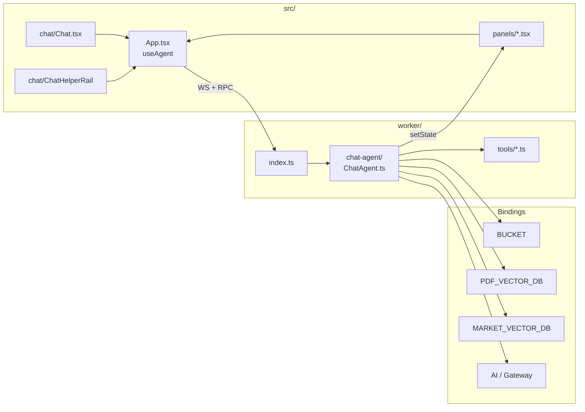
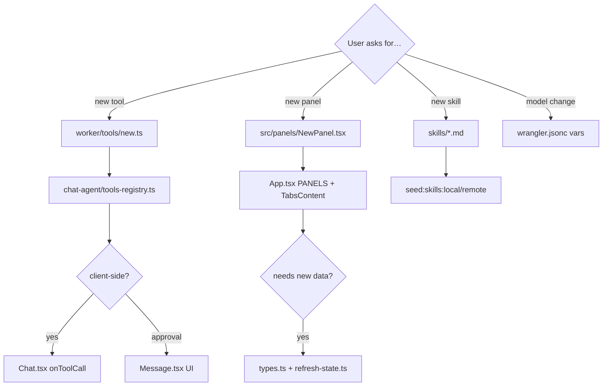

# jinu-agent-nexus — AI Development Guide

> Human docs (all under `docs/`): `README.md` (KO), `README.eng.md` (EN),
> `ARCHITECTURE.md` (flows), `MERGE_STRATEGY.md` (baseline overlay A/B/C),
> `ROUTING.md` (HTTP/FE tree), `INSTANCE_DATA.md` (shared vs personal DO data),
> `WORK_NOTES_3.md` (active work log; `_2` / `_1` archives).
> Root `CLAUDE.md` / `README.md` are short pointers here.
> This file is for **LLM-assisted development** — architecture, extension
> patterns, and constraints. Not a copy of the README.

## Project identity

- **Product brand (UI):** DAMI — slogan *The stories you care about, closer.* / *관심 있는 이야기를 더 가까이.* (tab
  title, chat header). Mark = custom D with star in the counter
  (`public/favicon.svg` + `src/components/BrandMark.tsx`, keep in sync).
  Warm paper palette (cream + orange accent) is **global** in
  `src/index.css` (`:root` / `.dark`) — shell and report pages share it.
  Repo/Worker rename later. Report pages use `← Home` for the `/`
  back-link (brand name alone was ambiguous).
- **Name:** `jinu-agent-nexus` (Worker, package, GitHub remote — keep until
  baseline port)
- **Origin:** Forked from Nomad Coders Cloudflare Agent Boilerplate
- **Remote:** `https://github.com/Jinu-hub/jinu-agent-nexus.git` — never push
  to nomadcoders upstream
- **Agent instance name:** Phase 1 guest id (`guest_<uuid>` in localStorage +
  `lyra_instance` cookie). `useAgent({ name })` and `/settings`·`/memory` share
  that name. Cron ingest settings still read ChatAgent `"default"`. Auth userId
  replaces guest later (`src/lib/agent-identity.ts`).

## Stack (do not reinvent)

| Layer | Tech |
|-------|------|
| Runtime | Cloudflare Workers + Durable Objects (SQLite per agent) |
| Agent | `Think` → `AIChatAgent` → `Agent` (`worker/chat-agent/`) |
| Frontend | React 19, Vite 8, Tailwind 4, shadcn-style UI |
| Chat hook | `@cloudflare/ai-chat/react` → `useAgentChat` |
| AI routing | `worker/ai.ts` — model from `wrangler.jsonc` vars |
| Tools | Vercel AI SDK `tool()` + Zod schemas |

## Current Cloudflare config

| Item | Value |
|------|-------|
| Worker name | `jinu-agent-nexus` |
| R2 bucket | `boilerplate-bucket` (binding `BUCKET`) |
| Workers KV | binding `NOTES` — My Market Notes (`/notes`) |
| Vectorize (PDF) | `pdf-vectorstore`, **768-dim** (binding `PDF_VECTOR_DB`) |
| Vectorize (Market) | `market-memory-vectorstore`, **768-dim** (binding `MARKET_VECTOR_DB`) |
| Default chat model | `@cf/zai-org/glm-4.7-flash` (Workers AI, free tier) |
| Default embed model | `@cf/baai/bge-base-en-v1.5` (768-dim, must match Vectorize) |
| AI Gateway name | `agent-boilerplate` (unused until non-`@cf/` models) |
| Voice Cron | UTC `0 0 * * *` + catch-up `0 1 * * *` (`voice-audio-cron.ts`) |
| Market vector Cron | UTC `5 0 * * *` (00:05) + catch-up `5 1 * * *` (01:05) — ko,en day ingest (`market-vector-cron.ts`) |
| Live poll room DO | `LiveMarketRoomAgent` (binding + class), room `market-pulse` |
| Secrets | `API_TOKEN`, `LIVE_ROOM_TOKEN` (optional), `SUPABASE_*` (optional), `ADMIN_USER_IDS` / `ADMIN_EMAILS` (optional Phase 3) in `.dev.vars` / `wrangler secret put` |

**Embedding dimension rule:** Changing `EMBEDDING_MODEL` may require dropping
and recreating **both** Vectorize indexes (`pdf-vectorstore`,
`market-memory-vectorstore`). See `worker/ai.ts` and README "Switching
models".

## Architecture in one pass



**Request routing (`worker/index.ts`):**

> Full path tree: [`ROUTING.md`](./ROUTING.md) (single source when paths change).

- `POST/GET /notes`, `GET /notes/:key` — Workers KV (My Market Notes)
- `/memory/*` — MyMemory DO SQLite (preferences, events, weights)
- `/live` — SPA-served Market Pulse poll room (LiveMarketRoomAgent over WS)
- `GET /api/supabase/health` — Supabase connectivity probe (Market Memory prep)
- `GET /api/briefs/today` — `content_briefs` daily market-issue text (Seoul `market_date`)
- `GET /api/briefs/latest-date` — newest `market_date` with a final brief (data-backed Latest)
- `GET /api/reports/today` — `item_contents` full report via `content_briefs.target_id` (+ `item_content_i18n` overlay by `lang`)
- `POST /api/market-vector/ingest` — chunk+embed report → `MARKET_VECTOR_DB`
- `POST /api/market-vector/query` — interest similarity search (+ date/item filters; `lang` filter via `MARKET_VECTOR_QUERY_FILTER_BY_LANG`, currently off)
- `POST /api/market-vector/clear` — delete Vectorize chunks for one report (no re-ingest)
- `POST /api/market-vector/cron/run` — daily ingest Cron once (prev UTC day × `MARKET_VECTOR_CRON_LANGS`)
- `POST /api/market-labels/resolve` — body-grounded Tags/Keywords display labels (B안; also post-ingest)
- `POST /api/upload` — PDF upload (not RPC; large FormData)
- `/screenshots/*` — R2 screenshot proxy
- Everything else → `routeAgentRequest` → ChatAgent DO
- **Must** `export { ChatAgent }` from `worker/index.ts`

**Where to edit (common tasks):**



## Repo layout

```
worker/
  index.ts             Worker entry — HTTP routing + DO re-export
  lib/                 Worker-only helpers — market-date, voice-lang-filter, report-keywords, market-labels-helper, market-vector-defaults, my-memory-stub, chat-ui-topic-map (see lib/README.md)
  notes.ts             My Market Notes — Workers KV API (`/notes`)
  my-memory.ts         MyMemory DO — preferences / events / weights
  memory-routes.ts     HTTP routes → MyMemory
  live-market-room.ts  Market Pulse poll room Agent — state + vote log
  supabase.ts          Supabase client factory + `/api/supabase/health`
  report-series.ts     report_series catalog (`/api/report-series`) for Settings Content
  market-day.ts        enabled series → market_memory_items slots (`/api/market/day`)
  market-item-resolve.ts  item_contents via mmi (ingest/query; no brief)
  market-settings.ts   read ChatAgent settings from Worker HTTP
  content-briefs.ts    content_briefs today read (`/api/briefs/today`)
  item-contents.ts     item_contents full report (`/api/reports/today` via brief.target_id; `item_content_i18n` by lang)
  market-vector.ts     Market report → MARKET_VECTOR_DB ingest (§14)
  market-vector-routes.ts  HTTP `POST /api/market-vector/{ingest,query,clear,cron/run}`
  market-vector-cron.ts    Daily ingest Cron (UTC 00:05 / 01:05)
  market-labels.ts     Topic label resolve orchestration
  market-labels-routes.ts  HTTP `POST /api/market-labels/resolve`
  market-memory-load.ts resolve→fetch→retry for brief/voice/report tools+prefetch
  content-audio.ts     Voice barrel (re-exports domain + routes)
  content-audio-domain.ts  content_audio queue / TTS→R2 / today
  content-audio-routes.ts  HTTP handlers for `/api/audio/*`
  chat-agent.ts        Re-export shim (imports use this path)
  chat-agent/
    ChatAgent.ts       Class — lifecycle + @callable RPC
    configure-session.ts
    soul-market.ts     Market RULE 5–7 + REPLY_LANG_LOCK (chat reply = this-turn user language; 해요체 only when Korean)
    tools-registry.ts  getBoilerplateTools + getMarketMemoryTools
    refresh-state.ts
    market-turn-hooks.ts beforeTurn/beforeStep Market seam
    market-intent.ts   Market / weather intent detection
    market-prefetch.ts beforeTurn Market Memory JSON inject
    rag.ts
    browser.ts
    reminders.ts
    panel-ops.ts
    types.ts           State types (imported by React panels)
    constants.ts
    settings.ts
  ai.ts                Model routing — change provider logic here
  ingest.ts            Markdown chunker for RAG ingest
  tools/               One tool per file. See "Extension patterns" below.
src/
  main.tsx             React entry — pathname switch (/live, /<series-slug>, shell)
  App.tsx              Main shell + helper rail + tab registry (PANELS array)
  i18n/                Screen chrome ko/en (`messages.ts`, `ui-lang.tsx`) — not chat reply language
  chat/                Chat UI (Chat, ChatHelperRail, Message, Markdown)
  panels/              One panel per file (+ `report-topics.tsx` for Market Topics)
  reports/             Standalone `/<report_series.slug>` reading pages
  components/ui/       shadcn-style primitives
  lib/utils.ts         cn() helper
  lib/market-date.ts   Seoul YMD helpers for Market panel (mirrors worker/lib/market-date.ts)
  lib/market-fetch.ts  Shared Market HTTP + promise cache (home rail + Market panel)
  lib/use-market-day-data.ts · use-market-preferences.ts  Hooks over market-fetch / MyMemory prefs (shared browse date + interests)
skills/                Markdown files seeded to R2 as on-demand context
wrangler.jsonc         All Cloudflare bindings and vars
worker-env.d.ts        Env augmentations (secrets + typed DO stub)
.dev.vars.example      Template for local secrets
```

## File map — where to change what

| Task | Files |
|------|-------|
| New server tool | `worker/tools/*.ts` → register in `worker/chat-agent/tools-registry.ts` |
| New client tool | Same + handler in `src/chat/Chat.tsx` `onToolCall` |
| Approval tool | Same + `needsApproval` on tool; UI in `Message.tsx` |
| New panel | `src/panels/*.tsx` → `PANELS` + `<TabsContent>` in `src/App.tsx` |
| Panel needs new data | Extend `State` in `chat-agent/types.ts` → `refresh-state.ts` |
| New skill | `skills/*.md` → `npm run seed:skills:local` or `:remote` |
| Change model | `wrangler.jsonc` vars only (usually no code change) |
| AI provider logic | `worker/ai.ts` |
| PDF ingest / chunking | `worker/ingest.ts`, RAG in `worker/tools/recall.ts` + `chat-agent/rag.ts` (`PDF_VECTOR_DB`) |
| Market report vectors | `worker/market-vector.ts` + `market-vector-routes.ts` + `market-vector-cron.ts` + `worker/lib/market-vector-defaults.ts` (chat topK/minScore + HTTP defaults) — ingest / query / clear / cron; id `mr_{itemId}_{lang}_{i}` (ko/en coexist); chat 「keyword」 via `market-vector-search.ts` → prefetch `vectorSearch` |
| My Market Notes (KV) | `worker/notes.ts` + `wrangler.jsonc` `kv_namespaces` |
| My Market Memory (DO SQLite) | `worker/my-memory.ts` + `memory-routes.ts`; preferences PK `(category, kind, target)` (`src/lib/preference-category.ts`); `topic_labels` + preferences.`display`; panel interests UI `src/lib/topic-preference.ts` + `MyInterestsFold.tsx`; chat prefetch `user-interests.ts` (P3) |
| Market topic labels | `worker/market-labels.ts` + `worker/lib/market-labels-helper.ts` + routes — body-grounded resolve (exact→hint→LLM); hint maps in `worker/lib` for ongoing slug→KO tuning; post-ingest hook; UI/vector expand consume cache |
| Market Pulse poll room | `worker/live-market-room.ts` + `src/live/LiveMarketRoom.tsx` + `src/lib/live-room.ts` |
| Report page (`/<slug>`) | `src/reports/ReportSurface.tsx` + `src/lib/report-pages.ts` (`REPORT_PAGES` + `REPORT_NAV_CATEGORIES` + optional `includeSeriesSlugs`); registered: `/daily-market-issues` (+ weekly-market companion tabs, `?series=`) and `/weekly-ai-issues` under shell **Market** category; routed by pathname in `src/main.tsx`; reads `/settings` + `/api/report-series` + `/api/market/{latest-date,day}` (multi `series_id`); DAMI warm palette is **global**; voice on active slot above depth tabs; `?tab=` brief / `for-you` / `full`; side chat pins `market_focus_series_id` to the **active** slot |
| Supabase (Market Memory) | `worker/supabase.ts` + `SUPABASE_*` secrets in `.dev.vars` |
| Content briefs (today) | `worker/content-briefs.ts` + `worker/lib/market-date.ts` → `GET /api/briefs/today` + `GET /api/briefs/latest-date`; chat tool `worker/tools/getTodayMarketBrief.ts` (lang = Settings `content_lang`; omit date = data-backed latest) |
| Full reports (today) | `worker/item-contents.ts` → `GET /api/reports/today`; primary `item_contents` + `item_content_i18n` overlay when `lang` ≠ primary `lang_code`; chat tool `getTodayMarketReport.ts` (excerpt + compact `keywords` via `worker/lib/report-keywords.ts`; lang = Settings `content_lang`) |
| Market panel (sidebar) | `MarketPanel.tsx` (`SHOW_MARKET_WORKBENCH=false` → slim card: pulse/takeaway + brief body + report blurb + voice + reading CTA; `true` → Brief/Voice/Report folds) + `ReportReader.tsx` + `report-topics.tsx` + `MyInterestsFold.tsx` + `BriefForYou.tsx` + `src/lib/market-date.ts` + `src/lib/market-tag-lexicon.ts` + `src/lib/market-fetch.ts` + `use-market-day-data.ts` + `use-market-preferences.ts` (shared with home helper rail; Ask 「」 uses display, save/target stays slug/name); Topics chips/Keywords in `report-topics.tsx` (re-exported by ReportReader); home Topics + Ask live in `ChatHelperRail`; off-switches unchanged; wired in `App.tsx`; registered series: 「이 리포트 자세히 보기」 → `readingHrefForSeriesSlug` (`report-pages.ts`) |
| ChatAgent settings | `worker/chat-agent/settings.ts` — cleanup/alarm fields remain in DO (not exposed in Settings UI) + `content_lang` (ko\|en; **screen chrome + Market Memory content**, not chat reply language) + `hidden_panels` (tab strip) + `disabled_report_series` (Market content opt-out) + `market_focus_series_id` (Market panel tab → chat vector scope); UI `SettingsPanel` Language + `ChromePrefs` on shell/report/live; Market tab sync in `App.tsx` |
| UI language (ko/en) | `src/i18n/messages.ts` + `src/i18n/ui-lang.tsx` (`UiLangProvider` / `useT`); wraps App / ReportSurface / LiveMarketRoom; `document.documentElement.lang` follows `content_lang` |
| Agent / MyMemory instance | `src/lib/agent-identity.ts` + `use-agent-instance.ts` + `src/lib/auth.tsx` + `chat-agent-query.ts` — Phase 1–5: guest / userId / admin / global panels / **ChatAgent WS JWT**. **`topic_labels` always `"default"`.** [`INSTANCE_DATA.md`](./INSTANCE_DATA.md) |
| report_series catalog | `worker/report-series.ts` → `GET /api/report-series` (+ `groups`: weekly+daily market issues 한 토글; service_role) |
| Market day (panel) | `worker/market-day.ts` → `GET /api/market/day` + `/api/market/latest-date` (`series_id`); MarketPanel tabs when 2+ slots |
| Market Memory intent | `market-turn-hooks.ts` + `market-intent.ts` + `market-prefetch.ts` + `market-vector-search.ts` + `soul-market.ts` + `market-memory-load.ts` — prefetch (`toolChoice: none`); 「keyword」 → `vectorSearch` (expand via report tag lexicon; empty → keywords/highlights literal fallback); ★ `interestHits` string match; beforeStep fallback for weather / no prefetch |
| Voice audio pipeline | `content-audio.ts` barrel + `content-audio-domain.ts` / `content-audio-routes.ts` + `voice-audio-cron.ts` (UTC `0 0` + catch-up `0 1`) → `/api/audio/*`; today play + tool `getTodayMarketVoice.ts` |
| New secret | `.dev.vars.example` + `worker-env.d.ts` + user's `.dev.vars` |
| Generated types | `npm run cf-typegen` → `worker-configuration.d.ts` (**never hand-edit**) |
| UI chat shell | `src/chat/Chat.tsx`, `Message.tsx`, `Markdown.tsx` + `HomeReportExits.tsx` + `ChatHelperRail.tsx` — empty state = DAMI intro + how-to + report landing cards (`REPORT_NAV_CATEGORIES`); helper rail = **Topics | Ask** tabs (default Topics; Ask = paper-surface + 1행 프롬프트 스크롤); header category menus (`Market` ▾ → pages, always shown); header `ChromePrefs` (theme + `content_lang`); Reset/Clear labels `xl+`; helper rail docks at `xl+`, right panels at `lg+`, drawers below (`App.tsx` `helperOpen` / `panelOpen`) |
| UI i18n toggle | `src/components/ChromePrefs.tsx` (theme + lang) + `src/i18n/ContentLangToggle.tsx` + `content-lang.ts` + `src/lib/theme.tsx` — shell / report / live; lang → ChatAgent `content_lang` |
| Chat transcript / input (shared) | `src/chat/ChatParts.tsx` (`ChatMessageList` + `ChatComposer`) + `src/chat/use-client-tools.ts`; each surface supplies its own header + `empty` state (shell = `Chat.tsx`, report page = `ReportChat.tsx`) |
| Voice in-chat player | `src/chat/Message.tsx` — `<audio>` when `getTodayMarketVoice` returns `playPath` |

## Extension patterns

### Tool factory conventions

- One file per tool under `worker/tools/`
- Export `createXxxTool()` factory (not a bare tool object)
- Use `tool()` from `"ai"` + `inputSchema: z.object({...})`
- Tool **key** in `getTools()` = LLM-visible name (e.g. `getWeather`)

**Needs `env` or agent?** Pass explicitly — `this.env` is `protected`:

```ts
recall: createRecallTool(this, this.env),
setReminder: createSetReminderTool(this),
```

Reference implementations:

- Server + API: `getWeather.ts`
- Server + Market Memory read: `getTodayMarketBrief.ts` (uses `content-briefs.ts`; `lang` from Settings `content_lang`)
- Server + Market Memory Voice: `getTodayMarketVoice.ts` (uses `content-audio.ts` → playPath; `lang` from Settings `content_lang`)
- Server + Market Memory Report: `getTodayMarketReport.ts` (uses `item-contents.ts`; summary/excerpt/highlights + compact `keywords`; `lang` from Settings `content_lang`)
- Server + agent: `setReminder.ts`, `recall.ts`, `screenshot.ts`
- Client-side (no execute): `getUserTimezone.ts` → resolve in `Chat.tsx`
- Approval: `sendNotification.ts`

### Panel / state sync

- `State` type lives in `worker/chat-agent/types.ts`
- `refreshPanelState()` in `refresh-state.ts` is the **single writer** for panel state
- Called from `onStart`, `onChatResponse`, and after mutating RPCs
- Frontend reads `agent.state` — do not duplicate state in React unless UI-only

### Callable RPC methods

- Add `@callable()` methods on `ChatAgent` for panel actions (upload, MCP
  connect, etc.)
- After mutations that affect panels → call `await this.refreshAll()`

## Hard rules for AI assistants

1. **Never scaffold features the user didn't ask for** (extra tools, panels,
   bindings).
2. **Minimize diff** — match existing patterns and comment style.
3. **Do not edit** `worker-configuration.d.ts` — run `npm run cf-typegen`.
4. **Do not commit** `.dev.vars` or secrets.
5. **Do not rename** R2/`boilerplate-bucket` casually. Vectorize is
   `pdf-vectorstore` + `market-memory-vectorstore` (do not merge
   casually — unified search is fan-out later).
6. **Preserve course-style comments** in worker code when touching nearby
   lines.
7. **Peer deps:** `@cloudflare/shell`, `@ai-sdk/react` are direct
   dependencies; avoid conflicting npm `overrides`.

## Common tasks → checklist

### "Add a tool"

1. Create `worker/tools/myTool.ts` (copy closest pattern)
2. Import + register in `tools-registry.ts`
3. If client-side → `Chat.tsx` `onToolCall`
4. If uses secret → `worker-env.d.ts` + `.dev.vars.example`
5. No panel change unless user asked

### "Add a panel"

1. Create `src/panels/MyPanel.tsx` (copy existing + `PanelHeader`)
2. Add to `PANELS` in `App.tsx`
3. If new state field → `types.ts` + `refresh-state.ts`
4. Wire `@callable` on agent if panel needs actions

### "Switch to AI Gateway"

1. Create gateway in Cloudflare dashboard
2. Set `CHAT_MODEL` / `EMBEDDING_MODEL` to `provider/model-id` in
   `wrangler.jsonc`
3. Ensure `API_TOKEN` with AI Gateway → Run
4. See README "Before production — switch to AI Gateway"

### "Deploy"

1. `npm run deploy`
2. `npx wrangler secret put API_TOKEN` for production secrets
3. `npm run seed:skills:remote` if skills changed

## Local dev pitfalls (known)

| Symptom | Fix |
|---------|-----|
| `Cannot find name 'Env'` | `npm run cf-typegen` |
| `vite: command not found` | `npm install` |
| `@cloudflare/shell` missing | `npm install @cloudflare/shell` |
| `@ai-sdk/react` missing | already in dependencies; `npm install` |
| `EOVERRIDE` on npm install | Don't duplicate `@ai-sdk/react` in `overrides` |
| `@cloudflare/workers-types` lint | `npm install -D @cloudflare/workers-types` |
| Browser Live View 404 locally | Expected without remote browser + `API_TOKEN` |
| `listStoredTargets does not exist` | RPC mismatch; often non-blocking in dev |

## Intentionally not in boilerplate

Do not add unless user explicitly requests (see README Recipes):

- Voice (`@cloudflare/voice`)
- Email (`send_email` binding)
- MCP Server expose (outbound)
- Workflows / sub-agents

## README pointer

Use `docs/README.md` for step-by-step setup, deploy, MCP connection UI, and course
phase recipes. Use `docs/ARCHITECTURE.md` for human-readable feature maps and
full sequence diagrams. Use `docs/ROUTING.md` when HTTP paths change.
This guide is for **implementation decisions**, not onboarding.
